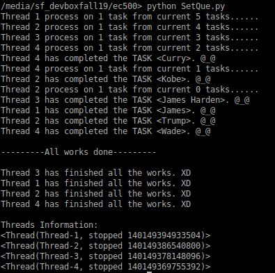

# video-E1visz
video-E1visz created by GitHub Classroom
## Project Mission
Develop a queue system that can collect the latest twitters of a given hashtage and convert the text to a short video summary in the same time.
## Architecture Needed

* Python code running on computer.    

* twitter API(Tweepy).  

* Pillow(PIL).  

* OpenCV(cv2).  

* Queue, Threading.  

## Run Program
*Assumes __OpenCV, Pillow__ package already installed.*

*Assumes __twitter API Keys__ available.*

*Requires __Python 3.x__ to run!*

1. Clone the repo by using the command below.
   ```
   $ git clone https://github.com/BUEC500C1/video-E1visz.git
   ```

2. Ensure the following Python packages are installed: cv2, PIL, tweepy
   ```
   $ pip install opencv  
   $ pip install pillow
   $ pip install tweepy
   ```
3. Add API key to local "configr.py" file and save:  
   ```
   consumer_key = "your API key"
   consumer_secret = "your API secret key"
   access_token = "your access token key"
   access_token_secret = "your access token secret key"
   ```
4. Open terminal/command window and navigate to folder where code was downloaded

5. Open "SetQue.py", enter the hashtag in the code below.
   ```
   hashtag = ['James', 'Kobe', 'James Harden', 'Curry', 'Wade', 'Trump']
   ```
6. run the "SetQue.py", the images and videos will be saved automatically in the local file system.


## Results

1. The image stored in the file system.  

2. The video stored in the file system.  
   <video src="https://github.com/BUEC500C1/video-E1visz/blob/master/Video/Curry.avi" controls="controls" width="500" height="300">您的浏览器不支持播放该视频！</video>

3. the UI for the threads.  
   


